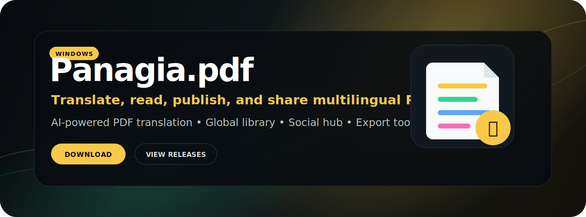

<p align="center">
  
</p>

<h1 align="center">Panagia.pdf</h1>

<p align="center">
  <strong>AI-powered multilingual PDF translation, reading, publishing, and social discovery for Windows.</strong>
</p>

<p align="center">
  <a href="https://github.com/ydkm24/panagia-pdf-releases/releases/latest"></a>
  <a href="https://github.com/ydkm24/panagia-pdf-releases/releases/latest"></a>
  <a href="#community"></a>
</p>

---

## Install

<p>
  <a href="https://github.com/ydkm24/panagia-pdf-releases/releases/latest">
    
  </a>
</p>

<details open>
<summary><strong>Windows</strong></summary>

1. Open the [latest release](https://github.com/ydkm24/panagia-pdf-releases/releases/latest).
2. Download `Panagia.pdf_Setup.exe`.
3. Run the installer.
4. Launch **Panagia.pdf** from the Start Menu or Desktop shortcut.

</details>

---

## Features

<table>
<tr>
<td width="50%">

### 🌍 Multilingual PDF Translation

Translate full PDFs into another language using the built-in Google-based translator path for quick default translations, or connect advanced AI models through OpenRouter for higher-quality model-driven translation workflows.

</td>
<td width="50%">

### 🤖 Bring Your Preferred AI Model

Use OpenRouter-compatible models for premium translation workflows, giving you flexibility to translate with different model families instead of being locked into one provider.

</td>
</tr>
<tr>
<td width="50%">

### 🧑‍🤝‍🧑 Social Hub

Chat with friends, browse the community activity feed, post and reply in forums, and keep up with news, updates, and announcements from inside the app.

</td>
<td width="50%">

### 📚 Global Library

Publish your translated books so other users can discover and read them, or browse books shared by the community. Share, repost, and surface books through your feed.

</td>
</tr>
<tr>
<td width="50%">

### 📤 Export Hub

Export finished translations as clean translated-only PDFs or side-by-side bilingual PDFs with the original text next to the translation.

</td>
<td width="50%">

### ⚡ Quick Translate

Translate a short piece of text or a single image without creating a full book project — useful for quick passages, screenshots, and one-off translation tasks.

</td>
</tr>
</table>

---

## App Preview

Screenshots are coming soon. Good preview images to add here would be:

- main PDF reader / translation workspace
- Export Hub
- Global Library
- Social Hub activity feed
- forum/newsroom area
- Quick Translate

---

## System Requirements

| Requirement | Details |
| --- | --- |
| Operating system | Windows 10 or newer |
| Runtime | Microsoft Edge WebView2 Runtime |
| Internet | Required for login, cloud sync, publishing, social features, and AI translation |
| Installer | `Panagia.pdf_Setup.exe` from GitHub Releases |

---

## Documentation

- [Install guide](docs/install.md)
- [Uninstall guide](docs/uninstall.md)
- [Troubleshooting](docs/troubleshooting.md)
- [System requirements](docs/system-requirements.md)
- [Security](SECURITY.md)
- [Privacy](PRIVACY.md)

---

## Community

Discord/community links can be added here when the invite is ready.

```text
Discord: coming soon
Support: coming soon
Website: coming soon
```

---

<details>
<summary><strong>Download verification</strong></summary>

If you want to verify the installer before running it, compare the SHA256 checksum:

```text
d3b93dd3bb70a7690728b738468b2a9ebb47dcd978a061380fd0483a62edaa09  Panagia.pdf_Setup.exe
```

Checksum file:

```text
checksums/v0.1.0-SHA256SUMS.txt
```

Release manifest:

```text
manifests/latest.json
```

</details>

---

<p align="center">
  <strong>Panagia.pdf</strong><br />
  Translate. Read. Publish. Share.
</p>
